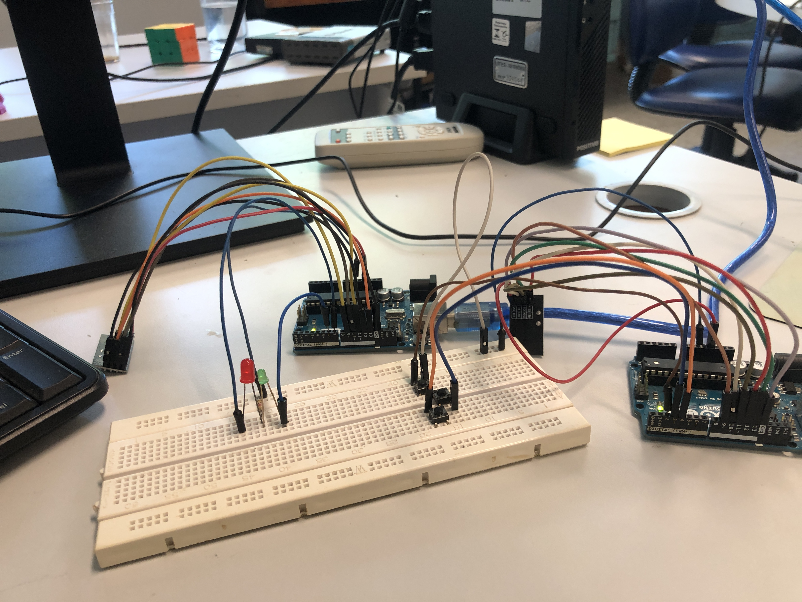

# hardware-gabriel-lyra-campos
# Comunicação wireless de 2 arduino uno

# Introdução
Este relatório é referente a um projeto de utilização de um  módulo Wireless NRF24L01+ para emitir e receber sinais de rádio que serão computados pelo arduino. Para que a comunicação ocorra corretamente é importante que o canal utilizado entre os módulos esteja entre 2,400 a 2,525 GH

# 1. Metodologia
## 1.1  Pesquisa e documentação
Inicialmente, procurou-se explorar a biblioteca nrf24 produzida para dar suporte a módulos  NRF24L01+  disponibilizada por TMRh20, que já estabelece uma pinagem base para o desenvolvimento do projeto.

## 1.2. Produção do projeto
Com base nos conhecimentos adquiridos na pesquisa da documentação, iniciou-se a produção do projeto físico onde utilizou-se:
2 arduino uno.
2 módulo RF wireless.
3 botões.
LED, buzzers ou displays gráficos.
A configuração física escolhida de pinos está demonstrada nas Figuras 1, 2, 3 e 4. Assim como a configuração final do projeto e o modelo de pinout do módulo na Figura 5.
Importante lembrar que se deve conectar o VCC do módulo em voltagens menores que 5v para evitar que queime.

Figura 1 - Projeto completo já montado com todas pinagens.

Figura 2 - Arduino receptor de sinal e suas pinagens. 

Figura 3 - Pintagens do arduino transmissor.

Figura 4 - Pinagem de referência geral  dos arduinos.

Figura 5 - Demonstração dos pinout existentes no módulo wireless NRF24L01.

## 1.3 Testes
Após a finalização do projeto, foi feito o teste e foi observado a sequência de acionamento esperado, 1 botão acende o led vermelho e 2 botões o led verde.
Nota-se que diferentes configurações podem ser facilmente aplicadas ao projeto, como mais leds, algum buzzer ou display para mostrar algum texto, até mesmo um sensor de som ou distância no transmissor para, quando acionados, mandar um sinal para o receptor.
